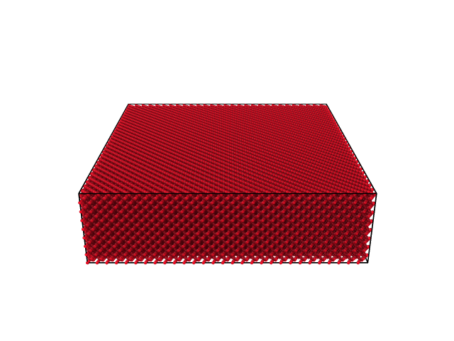
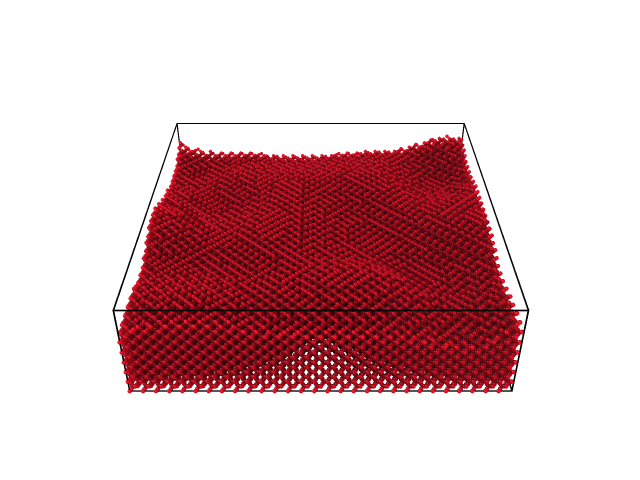

# Generating procedural surfaces
"_Perlin noise is a type of gradient noise developed by Ken Perlin in 1983 as a result of his frustration with the "machine-like" look of computer-generated imagery (CGI) at the time._" The main purpose was to generate realistic landscape for the Disney movie "Tron". After that, Perlin noise has been ubiquitous in CGI. In 2001, Ken Perlin introduced a improved procedural noise, named simplex noise, based on a simplex grid instead of a square grid. Our implementation of the procedural surface geometry relies on the noise library in Python. There, all the expensive operations are written in C++, making the function extremely fast despite a double loop.

The ```ProceduralSurfaceGeometry```-class is a child of the ```Geometry``` class, and carves out a procedural surface of a already existing object. We will here present a basic example where we carve out a procedural surface from a block of beta-cristobalite.

Firstly, we need to import the necessary stuff:
``` python
from molecular_builder import create_bulk_crystal, carve_geometry
from molecular_builder.geometry import ProceduralSurfaceGeometry
```

Secondly, a block of beta-cristobalite needs to be generated. We go with a block of dimensions (50Å, 200Å, 200Å).
``` python
atoms = create_bulk_crystal("beta_cristobalite", [50, 200, 200])
```



Before we carve out the procedural surface, we will list the arguments to the ```ProceduralSurfaceGeometry```-class with a short explanation. The class takes the arguments ```point```, ```normal```, ```thickness```, ```scale```, ```method``` and ```f```, in addition to all arguments that can be passed to the ```pnoise3``` and ```snoise3``` functions of the ```noise``` library. ```point``` is an equilibrium point of the noise, ```normal``` is the normal vector of the plane defining all the equilibrium points, ```thickness``` is the thickness of the noise, ```scale``` is the scale of the noise, ```method``` is either '```perlin```' or '```simplex```' and ```f``` is an arbitrary 3d function that is added to the noise.

The code below will carve out the desired surface:
``` python
geometry = ProceduralSurfaceGeometry(point=(40, 100, 100),
                                     normal=(1, 0, 0),
                                     thickness=20,
                                     octaves=1,
                                     method='simplex')
num_carved carve_geometry(atoms, geometry, side="in")
```

The result is



If the result is not satisfying, there are several parameters that can be changed. ```octaves``` is the level of details and ```scale``` is the scale of the structures. You should also consider changing the seed. See [the ```noise``` documentation](https://pypi.org/project/noise/) for more options. 
